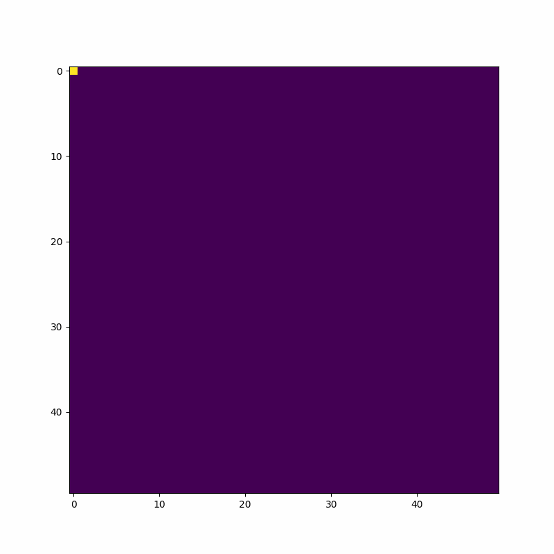

# A* Search Algorithm
## What type of algorithm is it ?
The A* Search given a starting node and end node of a graph, it tries to return the minimum path between the nodes based on some heuristic provided(i.e. distance, time, etc)

[Think GPS, Google Maps, Lyft, Uber and other apps that need a 'shortest' route ](https://www.google.com/maps/dir/RPM+Raceway+%7C+Race+Play+More,+Caven+Point+Road,+Jersey+City,+NJ/New+York,+NY/@40.7186414,-74.1041897,12z/data=!4m14!4m13!1m5!1m1!1s0x89c250e37a00c263:0x6ebef698e721f02d!2m2!1d-74.0731389!2d40.6997346!1m5!1m1!1s0x89c24fa5d33f083b:0xc80b8f06e177fe62!2m2!1d-74.0059728!2d40.7127753!3e0)

## How does it work generally speaking?
1. Needs a way to determine nodes that we have visited (to avoid repeat visits)

2. Needs a list/collection to determine nodes that we are still processing

3. We calculate 3 scores for the start node:
    * G-Score - or distance from start which is 0
    * H-Score - estimated Distance from end, which is calculated
    * F-Score - G-score + H-score

After calculating these scores for the start node, it is placed into the visited list and then we need to get all neighboring nodes for start node and repeat this process until we have a path from start to end.

## Code Walkthrough
* Node Class - This class is basically a Struct used to hold all the information for each position in the grid including:
    * POSITION - row, col
    * G-score/ distance from start
    * H-score/ estimated distance from end
    * Reference to the previous Node that current Node arrived from
* generateGrid - This creates a fresh N by N grid required for the A* Search
* aStarSearch - The main A* Search method that was loosely covered just above
* initializeNodes - used to turn 2D grid of numbers into 2D grid of Nodes that we can use to store the information needed to progress the A* Search
* calculateManhattanDistance - used to calculate the distance from current Node and end Node
* getNeighboringNodes - get at most 4 neighboring nodes from a single visited node and return these nodes to the processing list
* reconstructPath - last function called in the A* Search function, it returns the path generated in the A* Search from the end Node to the start

## Visualizations
Here is a visualization of the A* Search algorithm going from the starting point @ (0,0) => end @ (30, 30). The visualization was created using the Matplotlib library, I used to plot the n by n. Then using the animation library turned the plots into an animation. The algorithm uses the manhattan distance as the H-score (i.e. the heuristic score) that we use to determine a cell's distance from the end node and determine what cell is likely to be in the shortest path based on this score.

### A* Search on 50 X 50 grid with no obstacles


## Next Steps
* The graph is lacking any information beyond the ylim and xlim. The user gains no other information from looking at this visualization which is not ideal. So I definitely should label the animation with a title, xlabel and ylabel to make it more understandable

* add visualization of the Algorithm finding the shortest path with the obstacles present

* add the scores (F, G, and H) in each cell to give greater insight into what is going on at each step in the algorithm.

* Use another H-score like the Euclidean Distance, which would also take into account diagonal movements as well and this would increase the number of neighbors in consideration by 2 (i.e. @ most 4 neighboring nodes per cell * 2 times more directions = @ most 8 neighboring nodes per cell).

* Making the program interactive, where users can dynamically add obstacles into the grid and watch the A* algorithm dynamically update it's path. I considered doing this in PyGame but the library had a hard time with update the frames for a relatively small input for this program. So I have been experimenting with trying to send the outputs of the A* functions to a Node program or just re-writing the program in JavaScript in order to make that interactive piece. But I am a little stumped about how to go about adding this feature at the moment. Any suggestions are welcomed.

<b>I hoped you enjoyed this project please fork and experiment at your leisure</b>

# Update 10/19/2021
The code has been turned into a python package. I uploaded to test.pypi.org for the time being, so please check it out provide feedback and etc.
The link to the package is provided here for the reader's convenience: https://test.pypi.org/project/AStarSearch/

# How to install this Package
Use the following command to install the AStarSearch package
```pip install -i https://test.pypi.org/simple/ AStarSearch```
